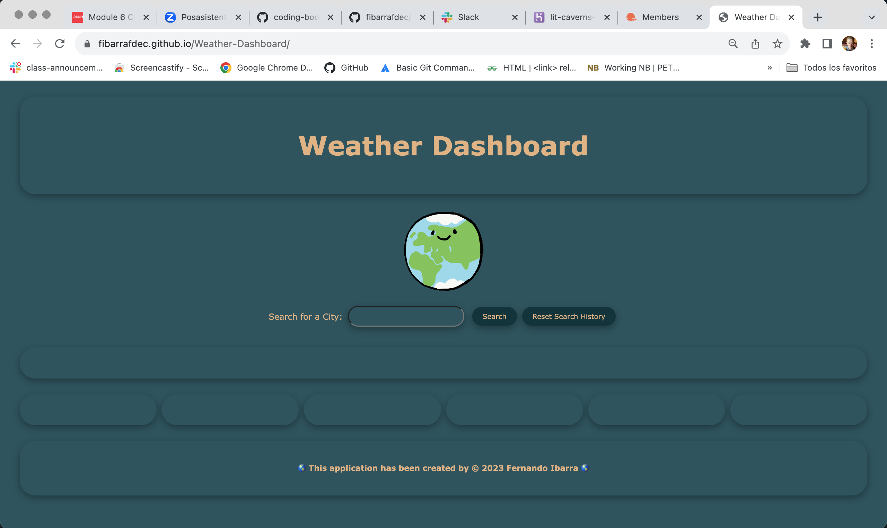
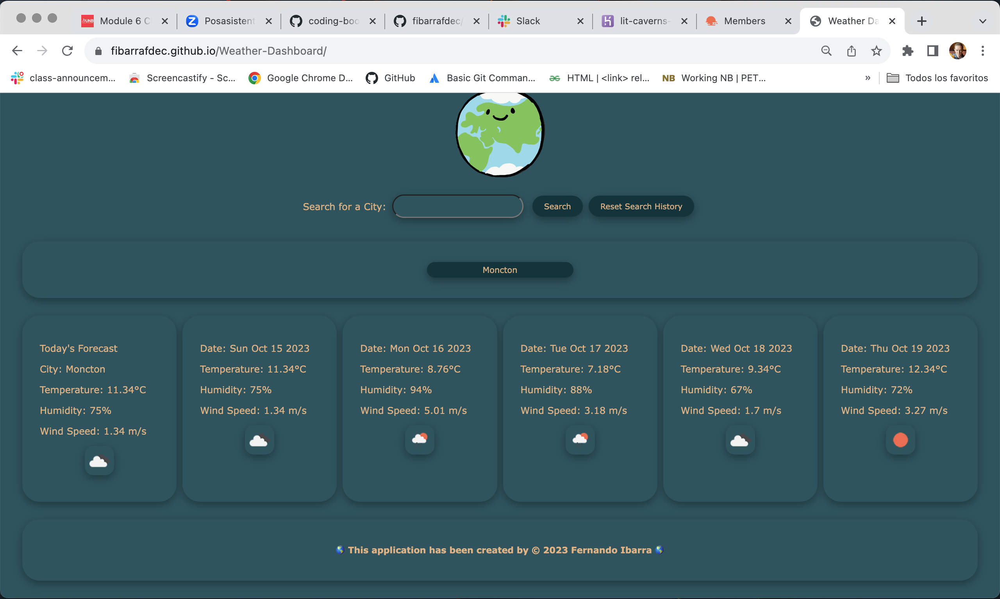
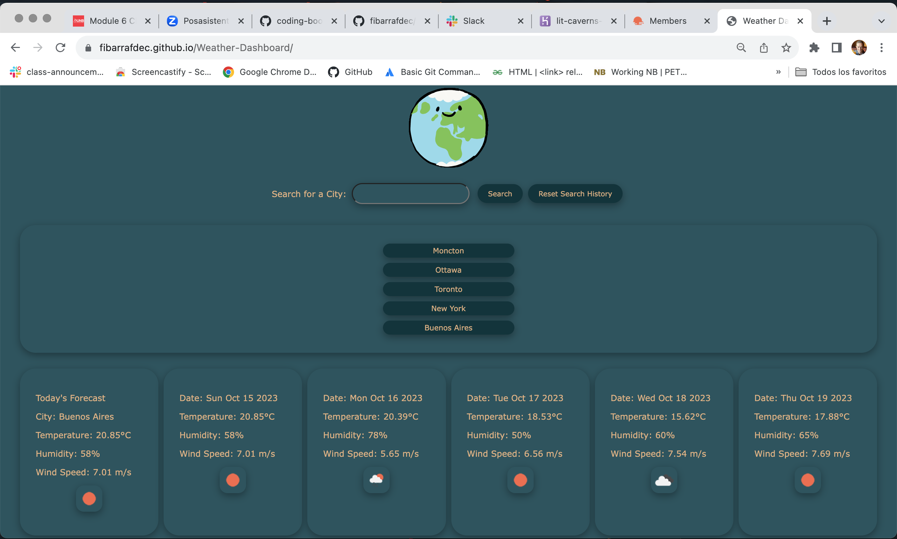

# Weather Dashboard

## Description
This online Web application is intended as a tool to allow the user to find the weather of a city for the current date, and 5 more days.

[](https://opensource.org/licenses/MIT)

## Table of Contents:

- [Overview](#Overview)
- [The Challenge](#The-Challenge)
- [User Story](#User-Story)
- [Acceptance Criteria](#Acceptance-Criteria)
- [Mock Up Image](#Mock-Up-Image)
- [Installation Instructions](#Installation-Instructions)
- [Usage Instructions](#Usage-Instructions)
- [Technologies Used](#Technologies-Used)
- [Deployed Application Link](#Deployed-Application-Link)
- [Video Location](#Video-Location)
- [Screenshots](#Screenshots)
- [Test](#Test)
- [Questions](#Questions)
- [Credits](#Credits)
- [License](#License)

# Overview

## Challenge
"The challenge is to build a weather dashboard that will run in the browser and feature dynamically updated HTML and CSS.."

## User Story

```md
AS A traveler,
I WANT to see the weather outlook for multiple cities,
SO THAT I can plan a trip accordingly.
```

## Acceptance Criteria

```md
GIVEN a weather dashboard with form inputs,
WHEN I search for a city,
THEN I am presented with current and future conditions for that city and that city is added to the search history,
WHEN I view current weather conditions for that city,
THEN I am presented with the city name, the date, an icon representation of weather conditions, the temperature, the humidity, and the the wind speed,
WHEN I view future weather conditions for that city,
THEN I am presented with a 5-day forecast that displays the date, an icon representation of weather conditions, the temperature, the wind speed, and the humidity,
WHEN I click on a city in the search history,
THEN I am again presented with current and future conditions for that city.
```

## Mock-Up Image 

The following image shows the desired web application's appearance and functionality:


## Installation Instructions

This is an online Web Application deployed through GitHub, hence it doesn't need user's installation. 

## Usage Instructions
1. Open the web page using the link provided further in this README file, 
2. Read the promp and click on its button, 
3. Write down a city's name, 
4. Click on the Search button.
5. Check the weather.
6. Search another City,
7. Reset the Search History clicking on the Reset button.

## Technologies Used
- Visual Studio Code: [Website](https://code.visualstudio.com/)

## Deployed Application Link
[Deployed Application Link:](https://fibarrafdec.github.io/Weather-Dashboard/)

## Video Location
[Weather Dashboard](https://drive.google.com/file/d/1bY0-OrbczRD6owQ65T39eW5HS0qktWaY/view?usp=sharing)

## Screenshots




## Test
This application has been tested running it after deployment with GitHub.

## Questions?

If you have any questions related with this Express Note Taker, feel free to reach me through:

Email:[fibarrafdec@gmail.com](fibarrafdec@gmail.com)

GitHub username:[fibarrafdec](fibarrafdec)
GitHub link: https://github.com/fibarrafdec

## Credits
This application has been created by © 2023 Fernando Ibarra [fibarrafdec](https://github.com/fibarrafdec).

## License & Copyright ©
This application is covered under the MIT License.
[](https://opensource.org/licenses/MIT)

### Copyright © 2023 Fernando Ibarra
```md
Permission is hereby granted, free of charge, to any person obtaining a copy
of this software and associated documentation files (the "Software"), to deal
in the Software without restriction, including without limitation the rights
to use, copy, modify, merge, publish, distribute, sublicense, and/or sell
copies of the Software, and to permit persons to whom the Software is
furnished to do so, subject to the following conditions:

The above copyright notice and this permission notice shall be included in all
copies or substantial portions of the Software.

THE SOFTWARE IS PROVIDED "AS IS", WITHOUT WARRANTY OF ANY KIND, EXPRESS OR
IMPLIED, INCLUDING BUT NOT LIMITED TO THE WARRANTIES OF MERCHANTABILITY,
FITNESS FOR A PARTICULAR PURPOSE AND NONINFRINGEMENT. IN NO EVENT SHALL THE
AUTHORS OR COPYRIGHT HOLDERS BE LIABLE FOR ANY CLAIM, DAMAGES OR OTHER
LIABILITY, WHETHER IN AN ACTION OF CONTRACT, TORT OR OTHERWISE, ARISING FROM,
OUT OF OR IN CONNECTION WITH THE SOFTWARE OR THE USE OR OTHER DEALINGS IN THE
SOFTWARE.
```
